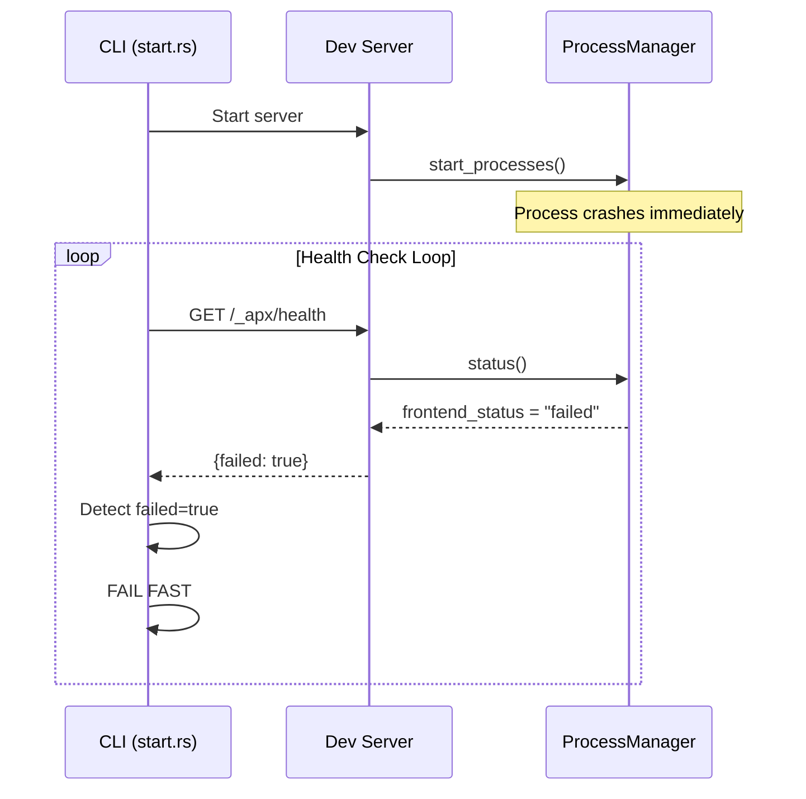

# Fail-Fast Logic and Frontend Dependency Verification

## Summary

Added fail-fast logic to detect unrecoverable process failures during dev server startup, and automatic installation of frontend dependencies required by `entrypoint.ts` before running any frontend command.

## Context

### Problem 1: No Fail-Fast for Dead Processes

When a process (Vite or uvicorn) crashed immediately (e.g., Python syntax error, Vite config error), the health check loop would keep polling until timeout instead of detecting the failure early.

### Solution 1: Fail-Fast Detection

1. Modified `status_for_process()` to return `"failed"` instead of `"stopped"` when a process has exited
2. Added `failed: bool` field to `HealthResponse` (server) and `StatusResponse` (client)
3. Health endpoint sets `failed = frontend_status == "failed" || backend_status == "failed"` (DB excluded - non-critical)
4. Health check loop detects `failed` flag and returns error immediately

### Problem 2: Missing Frontend Dependencies

The `entrypoint.ts` requires specific npm packages that might not be in the project's `package.json`.

### Solution 2: Automatic Dependency Installation

1. Added `ENTRYPOINT_DEV_DEPS` constant listing required packages (vite, @tailwindcss/vite, @vitejs/plugin-react, etc.)
2. Created `ensure_entrypoint_deps()` function that checks `package.json` and runs `bun add --dev` for missing deps
3. Called before frontend dev and build commands

## Diagram

## Relevant Files

- `src/dev/process.rs` - `status_for_process()` returns "failed" for exited processes
- `src/dev/server.rs` - `failed` field in HealthResponse, health endpoint logic
- `src/dev/client.rs` - `failed` field in StatusResponse
- `src/cli/dev/start.rs` - fail-fast detection in `wait_for_healthy_with_logs()`
- `src/common.rs` - `ENTRYPOINT_DEV_DEPS` constant and `ensure_entrypoint_deps()` function
- `src/cli/frontend/dev.rs` - calls `ensure_entrypoint_deps()` before running
- `src/cli/frontend/build.rs` - calls `ensure_entrypoint_deps()` before running
- `src/apx/assets/entrypoint.ts` - the frontend entrypoint that requires these deps

## Notes

- **Deadlock prevention preserved**: Mutex is still released before HTTP probes in `status_for_process()`
- **DB remains non-critical**: DB status not included in `failed` check
- **Parallel health checks preserved**: `tokio::join!` in `status()` unchanged
- See also: `healthcheck-rework.md` in this directory for original healthcheck fixes
