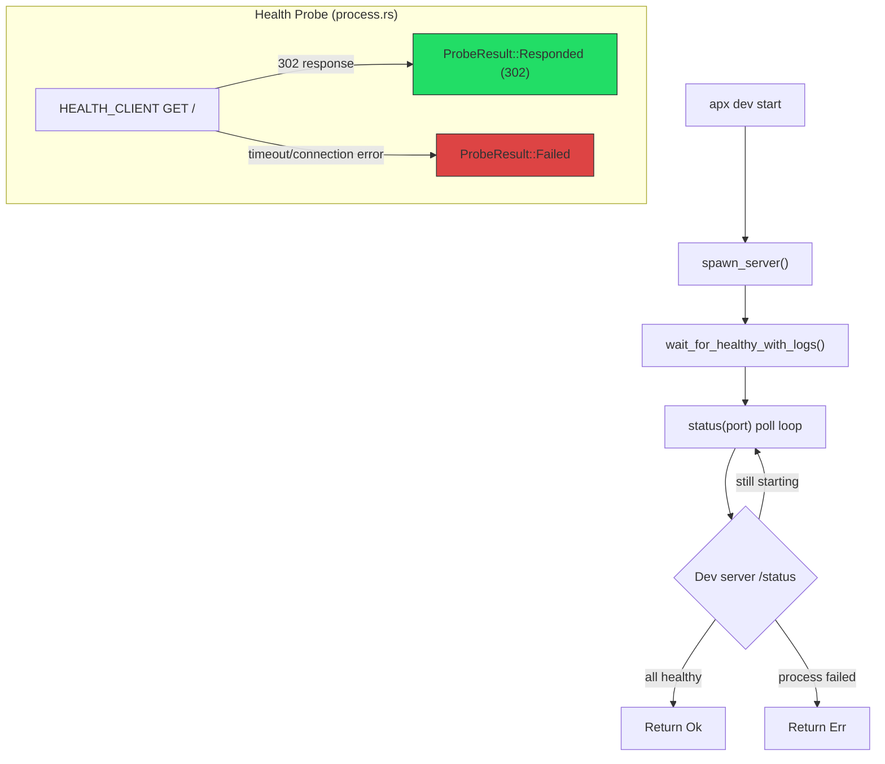

# Healthcheck Redirect Bug Fix & Module Extraction

## Summary

Fixed a critical bug where newly generated projects failed to start because the health probe HTTP client followed 302 redirects into a timeout chain. Also fixed a macOS log path mismatch and extracted the healthcheck logic into its own module.

## Context

### The Bug

`apx dev start` spawns a dev server, then polls it via `wait_for_healthy_with_logs()`. The health probe sends `GET http://127.0.0.1:{frontend_port}/` to Vite. Vite's dev-token middleware sees no `x-apx-dev-token` header and returns a **302 redirect** to the Axum dev server. The `HEALTH_CLIENT` (reqwest) followed this redirect by default, which triggered a proxy round-trip back to Vite. This round-trip exceeded the 1-second `PROBE_TIMEOUT_SECS`, so the probe always returned `ProbeResult::Failed` and the frontend stayed in `"starting"` state forever.

### The Fix (3 changes)

1. **Redirect policy** (`crates/core/src/dev/process.rs`): Added `.redirect(reqwest::redirect::Policy::none())` to `HEALTH_CLIENT`. A 302 is a valid HTTP response proving the server is listening -- no need to follow it.

2. **Log path canonicalization** (`crates/core/src/dev/process.rs`): `ProcessManager::new()` now canonicalizes `app_dir` so that `forward_log_to_flux()` uses the same path as `StartupLogStreamer`. On macOS, `/tmp/foo` canonicalizes to `/private/tmp/foo`, and the mismatch caused startup logs to appear empty.

3. **Module extraction**: Moved `wait_for_healthy_with_logs()` from `ops/dev.rs` to new `ops/healthcheck.rs` for better separation of concerns.

## Diagram

## Relevant Files

- `crates/core/src/dev/process.rs` - `HEALTH_CLIENT` (redirect policy fix, line ~34), `ProcessManager::new()` (canonicalize fix, line ~181), `http_health_probe()`, `status_for_process()`
- `crates/core/src/ops/healthcheck.rs` - **NEW** - extracted `wait_for_healthy_with_logs()` from ops/dev.rs
- `crates/core/src/ops/dev.rs` - `spawn_server()` calls `wait_for_healthy_with_logs()` (now imported from healthcheck module)
- `crates/core/src/ops/mod.rs` - declares `pub mod healthcheck`
- `crates/core/src/ops/startup_logs.rs` - `StartupLogStreamer` (canonicalizes its own `app_dir`, which was mismatching before the fix)

## Notes

- The startup flow is: `apx dev start` -> `spawn_server()` -> subprocess runs `__internal__run_server` -> `ProcessManager` spawns Vite/uvicorn/PGlite
- `PROBE_TIMEOUT_SECS` is 1 second and must be strictly less than `DEFAULT_TIMEOUT_SECS` in client.rs to avoid a race
- The dev-token middleware redirect chain: Vite (no token) -> 302 to dev server -> proxy back to Vite (with token). This is by design for browser auth, but health probes should not follow it
- `spawn_server()` in ops/dev.rs already canonicalizes `app_dir` before passing as `APX_APP_DIR` env var (line ~340), but `ProcessManager::new()` was receiving the non-canonical path
