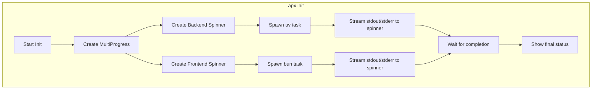

# Real-time Streaming Progress for Init Command

## Summary

Added real-time streaming output for `uv` and `bun` installations during `apx init`. Both processes now display their output in separate rows using `indicatif::MultiProgress`, so users can see what's happening with each tool simultaneously.

## Context

Previously, the `apx init` command ran `uv` (Python backend) and `bun` (frontend) installations in parallel but hid their output behind a single spinner showing "📦 Installing dependencies...". Users had no visibility into what was happening during potentially long installation times.

The implementation now shows two separate progress rows:

- `🐍 Python: <streaming uv output>`
- `📦 Frontend: <streaming bun output>`

Each row updates independently in real-time as the respective tool outputs progress information.

## Diagram

## Relevant Files

- `src/common.rs` - Added `multi_progress()`, `multi_spinner()`, `run_command_streaming()`, `bun_install_streaming()`
- `src/cli/init.rs` - Updated dependency installation section to use streaming, added `setup_backend_streaming()`

## Notes

- Uses `tokio::io::AsyncBufReadExt` to read stdout/stderr line by line
- Both stdout and stderr are captured and displayed (whichever has output last wins for the spinner message)
- The non-streaming `setup_backend()` function was removed as it became unused
- Similar pattern could be applied to other long-running CLI commands if needed
