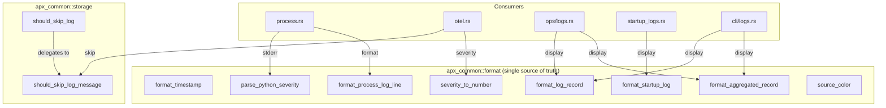

# Logging System Refactoring

## Summary

Centralized all log formatting, timestamp handling, severity parsing, and skip-filtering into `apx_common::format`. Fixed stderr severity mapping (uvicorn INFO was stored as ERROR), added agent version checking in flux daemon, and removed dead code.

## Context

The APX logging system had grown organically across 6+ crates with inconsistent patterns:
- 5 different timestamp formats (UTC vs Local, with/without date)
- All uvicorn stderr was tagged as ERROR (severity 17) — even normal `INFO: Uvicorn running...`
- Duplicate `should_skip_log()` implementations with different filter sets
- No agent version check — old flux daemon kept running after apx upgrade
- Dead code: `APX_COLLECT_LOGS` env var, `installed_version()` function

### Key decisions

1. **All user-facing timestamps use Local timezone** — `format_timestamp()` always converts to local. The old `format_log_line` in process.rs used UTC; now uses Local.
2. **Single `format_startup_log` uses full timestamp** (`YYYY-MM-DD HH:MM:SS.mmm`), not short (`HH:MM:SS.mmm`). User explicitly requested this.
3. **Stderr severity parsing** via `parse_python_severity()` — matches patterns like `INFO    /`, `WARNING:`, `ERROR   /` etc. Defaults to `"INFO"` since most uvicorn stderr is informational.
4. **Version check via lock file** — `FluxLock` now has `version: Option<String>` (with `#[serde(default)]` for backward compat). `ensure_running()` compares lock version to `apx_common::VERSION`.
5. **Unified skip filtering** — `should_skip_log_message(message: &str)` is the raw-string entry point; `should_skip_log(&LogRecord)` wraps it with severity-based _core filtering. Password patterns (`WITH PASSWORD`, `PASSWORD '`) now filtered in both paths.

## Diagram

## Relevant Files

- `crates/common/src/format.rs` — **NEW** centralized formatting module
- `crates/common/src/storage.rs` — unified `should_skip_log` + `should_skip_log_message`
- `crates/common/src/lib.rs` — `VERSION` const, `FluxLock.version` field, `pub mod format`
- `crates/core/src/dev/process.rs` — uses `parse_python_severity` for stderr, `format_process_log_line` for timestamps
- `crates/core/src/dev/otel.rs` — removed duplicate `severity_to_number` and `should_skip_log`
- `crates/core/src/ops/logs.rs` — removed local format fns, imports from `apx_common::format`
- `crates/core/src/ops/startup_logs.rs` — removed local format fns, imports from `apx_common::format`
- `crates/core/src/flux/mod.rs` — `ensure_running()` checks version, restarts on mismatch
- `crates/cli/src/dev/logs.rs` — updated imports to `apx_common::format`
- `crates/agent/src/main.rs` — tracing uses `APX_LOG` env, stderr writer, file/line info
- `crates/agent/src/server.rs` — replaced `eprintln!` with `info!()`
- `crates/core/src/agent.rs` — removed dead `installed_version()`
- `crates/core/src/ops/dev.rs` — removed dead `APX_COLLECT_LOGS` env var

## Notes

- `format_short_timestamp` still exists in format.rs but has no callers — candidate for removal
- The `just gen` command installs from `dist/` wheel — must rebuild wheel (`just build --release` + copy to dist) to test Rust changes
- The `apx-db` crate has a flaky test `logs::tests::test_create_and_insert` — pre-existing, not related to this work
- Agent tracing now uses `APX_LOG` env var (same as main binary) instead of `RUST_LOG`
