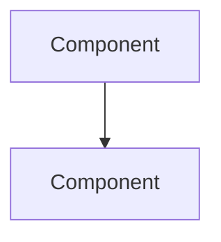
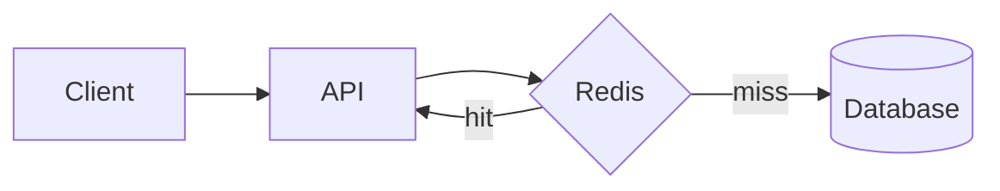

# Memory Skill

Save important conversation context, decisions, and insights as persistent memory files for future reference.

## Commands

### memorize

Saves a memo of the current conversation to a memory file.

**Usage**: User says "memorize this", "save this to memory", "remember this", or similar.

**Workflow**:

1. **Analyze the conversation** to identify:
   - Key decisions made
   - Important context or insights
   - Relevant code patterns or architecture
   - Files that were discussed or modified

2. **Generate a memory ID** based on the topic (lowercase, hyphens, e.g., `auth-flow-decision`, `api-refactor-plan`)

3. **Create the memory file** at `.cursor/skills/memory/memories/<memory-id>.md`

4. **Confirm** the memory was saved with the file path

## Memory File Format

```markdown
---
name: <memory-id>
created: <YYYY-MM-DD>
tags: [<relevant>, <tags>]
---

# <Title>

## Summary

<Brief 2-3 sentence summary of what this memory captures>

## Context

<Detailed description of the conversation context, decisions made, and reasoning>

## Diagram

<Include a mermaid diagram if the memory involves architecture, flow, or relationships>



## Relevant Files

<List of files that are relevant to this memory>

- `path/to/file1.ts` - <brief description>
- `path/to/file2.py` - <brief description>

## Notes

<Any additional notes, caveats, or follow-up items>
```

## Guidelines

- **Be concise**: Capture the essence, not every detail
- **Include diagrams**: When the memory involves architecture, flows, or relationships, add a mermaid diagram
- **List relevant files**: Always include files that were discussed or are relevant to the memory
- **Use descriptive IDs**: Memory IDs should be meaningful and searchable
- **Add tags**: Include tags for easier discovery later

## Example

If a conversation discussed implementing a caching layer for the API:

```markdown
---
name: api-caching-decision
created: 2026-01-29
tags: [api, caching, redis, performance]
---

# API Caching Strategy Decision

## Summary

Decided to implement Redis-based caching for expensive API endpoints with a 5-minute TTL for user data and 1-hour TTL for static content.

## Context

The API was experiencing performance issues with repeated database queries for the same data. After discussing options (in-memory, Redis, file-based), Redis was chosen for its persistence and ability to share cache across instances.

## Diagram



## Relevant Files

- `src/backend/cache.py` - cache implementation
- `src/backend/config.py` - cache configuration
- `src/backend/router.py` - endpoints using cache

## Notes

- Consider adding cache invalidation on data updates
- Monitor cache hit rates after deployment
```
