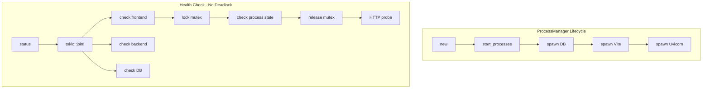

# Healthcheck Logic Rework

## Summary

Reworked the dev server healthcheck logic to fix spawn order, prevent deadlocks from mutex contention during HTTP timeouts, and make health checks run in parallel.

## Context

### Problem

1. Wrong spawn order (Vite → DB → Uvicorn instead of DB → Vite → Uvicorn)
2. Potential deadlock: `status_for_child()` held mutex during 2-second HTTP timeout
3. Health checks ran sequentially, blocking each other
4. Server didn't start accepting requests until all processes spawned

### Solution

**ProcessManager Split**: Split `ProcessManager::start()` into two methods:

- `new()` - Creates manager synchronously (no spawning)
- `start_processes()` - Spawns processes in background task

```rust
// In server.rs
let process_manager = Arc::new(ProcessManager::new(&app_dir, ...)?);
process_manager.start_processes(); // Returns immediately
```

**Spawn Order**: DB → Vite → Uvicorn (sequential, but in background task)

**DB is Non-Critical**: DB failure logs warning but doesn't block other processes:

```rust
if let Err(e) = pm.spawn_pglite(&bun_path).await {
    warn!("⚠️ Failed to start PGlite database: {}. Continuing without DB.", e);
    // Don't return - continue with Vite and Uvicorn
}
```

**Async Health Checks (No Deadlock)**: Release mutex immediately after checking process state, then do HTTP probe without holding any locks.

```rust
pub async fn status(&self) -> (String, String, String) {
    tokio::join!(
        self.status_for_process(&self.frontend_child, Some(("localhost", self.frontend_port))),
        self.status_for_process(&self.backend_child, Some((&self.host, self.backend_port))),
        self.status_for_process(&self.db_child, None), // DB: no HTTP check
    )
}

async fn status_for_process(&self, child: &Arc<Mutex<Option<Child>>>, http_check: Option<(&str, u16)>) -> String {
    // Quick mutex access - released before HTTP probe
    let process_running = {
        let mut guard = child.lock().await;
        // ... check process state
    }; // Mutex released here!

    // HTTP probe happens AFTER mutex is released
    match http_check {
        None => "healthy".to_string(), // DB: running = healthy
        Some((host, port)) => {
            if Self::http_health_probe(host, port).await { "healthy" } else { "starting" }
        }
    }
}
```

**Health Endpoint**: Only frontend + backend must be healthy for `"ok"` status (DB status reported but doesn't affect overall status).

## Diagram



## Relevant Files

- `src/dev/process.rs` - ProcessManager split, async status methods
- `src/dev/server.rs` - Server startup with background process spawning
- `src/cli/dev/start.rs` - Client-side health polling

## Notes

- The deadlock risk was caused by holding a mutex while awaiting an async HTTP request with a 2-second timeout
- Multiple concurrent health checks would serialize, each waiting up to 2 seconds
- **Fix:** Release mutex immediately after checking process state, then do HTTP probe without holding any locks
